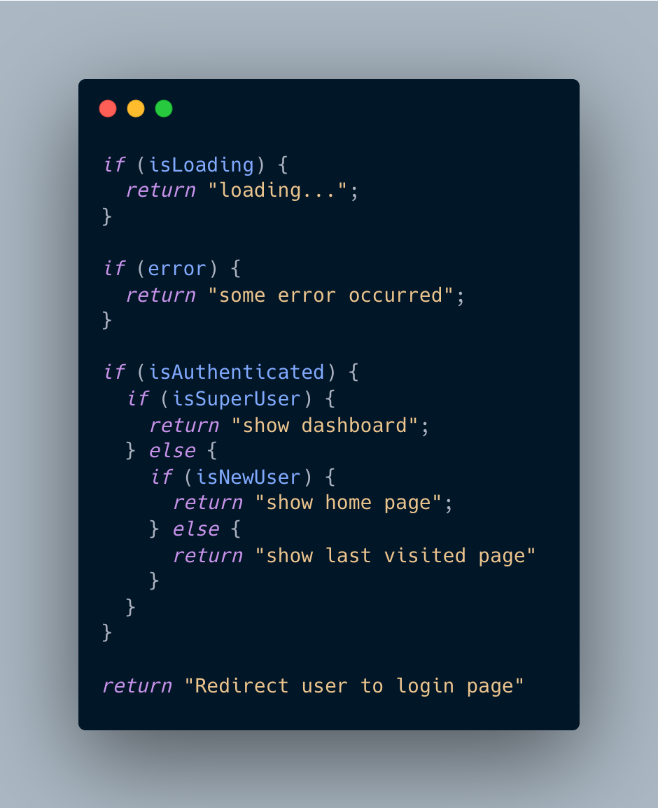
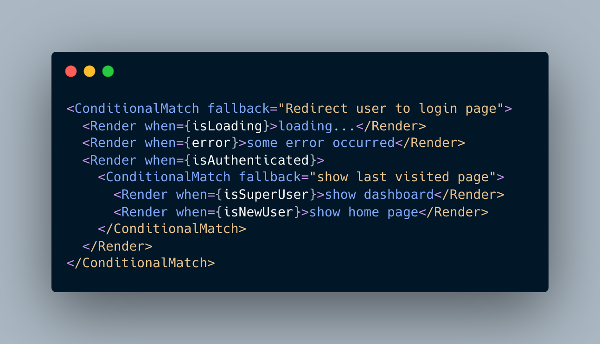

# Conditional Match

[](https://bundlephobia.com/package/@dx-kit/react-conditional-match)
[](https://opensource.org/licenses/MIT)

A lightweight and flexible React component for conditional rendering that supports multiple matches and fallbacks.

Use it to implement complex rendering logic without having to write complex conditional logic with ternaries or if-else blocks.

[DEMO](https://stackblitz.com/edit/vitejs-vite-sz2s9x)

## Features

- **Multiple render conditions**: With ConditionalMatch, you can specify multiple conditions for rendering different components based on the current state of the application.

- **Supports multiple matches**: Use the <code>ConditionalMatch </code>component to render multiple children based on the conditions you define. The component will render all children that match the condition.
- **Supports fallback**: Use the "fallback" prop to provide a fallback for when none of the children match the condition.
- **TypeScript support**: ConditionalMatch is built with TypeScript and provides type definitions for easy integration into TypeScript projects.
- **Lightweight and flexible**: The ConditionalMatch component is small and can be easily integrated into any React project.

## Installation

You can install the <code>@dx-kit/react-conditional-match</code> component using npm or yarn or pnpm:

```
npm i @dx-kit/react-conditional-match
```

or

```
yarn add @dx-kit/react-conditional-match
```

or

```
pnpm i @dx-kit/react-conditional-match
```

## Usage

> **See more examples here** - [examples](https://stackblitz.com/edit/vitejs-vite-sz2s9x)

To use the ConditionalMatch component in your React project, you need to import it and use it in your JSX code.

```typescript
import React, { useState } from "react";
import { ConditionalMatch } from "@dx-kit/react-conditional-match";

const MyComponent = () => {
  const [val, setVal] = useState(2);

  return (
    <ConditionalMatch fallback={<div>No matches found.</div>}>
      <ConditionalMatch.Render when={val < 5}>{val} is less than 5</ConditionalMatch.Render>
      <ConditionalMatch.Render when={val === 5}>{val} is equal than 5 </ConditionalMatch.Render>
      <ConditionalMatch.Render when={val > 5}>{val} is greater than 5 </ConditionalMatch.Render>
    </ConditionalMatch>
  );
};
```

In this example, the ConditionalMatch component will render the first child that matches one of the conditions. If none of the children match the condition, the component will render the fallback element.

```typescript
<ConditionalMatch fallback='Initial state'>
  <Render when={loading}>Loading...</Render>
  <Render when={data?.length}>
    <DataComp data={data} />
  </Render>
  <Render when={error}>{error}</Render>
</ConditionalMatch>
```

## Usage compared with _if-else_ and _ternary_

|                      | Image                                                | Description                                                                                       |
| -------------------- | ---------------------------------------------------- | ------------------------------------------------------------------------------------------------- |
| **if-else**          |                      | - Simple syntax<br>- Easy to read                                                                 |
| **ternary**          |                      | - More concise <br /> - Harder to read.                                                           |
| **ConditionalMatch** |  | - Easy nesting <br/> - Simple syntax <br /> - Easy to read <br /> - Supports **multiple matches** |

<br/>

## Props

### _ConditionalMatch_

| Prop name  | Type                                   | Default value | Description                                                               |
| ---------- | -------------------------------------- | ------------- | ------------------------------------------------------------------------- |
| fallback   | `React.ReactNode`                      | -             | The fallback element to render if no children match the condition         |
| children   | `JSX.Element \| JSX.Element[] \| null` | `null`        | The children to search for a matching condition                           |
| multiMatch | `boolean`                              | `false`       | Whether to render all matching children (if true) or only the first match |

### _Render_

| Prop name | Type                                | Description                                               |
| --------- | ----------------------------------- | --------------------------------------------------------- |
| when      | `T \| undefined \| null \| boolean` | The condition to determine whether to render the children |
| children  | `React.ReactNode`                   | The children to render if the condition is true           |

## Contributing

If you find a bug or have an idea for a new feature, feel free to submit an issue or pull request on the GitHub repository: [https://github.com/hardyyb2/react-conditional-match.git](https://github.com/hardyyb2/react-conditional-match.git)
